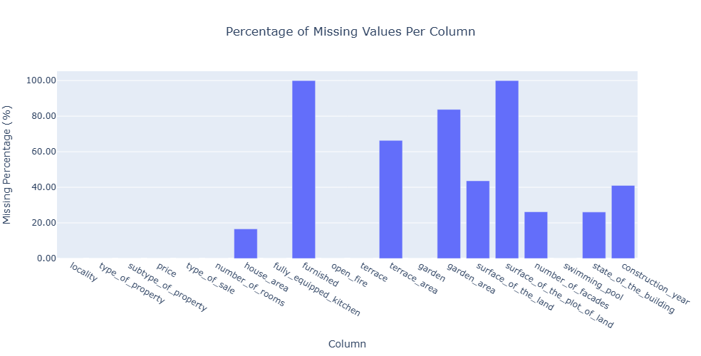
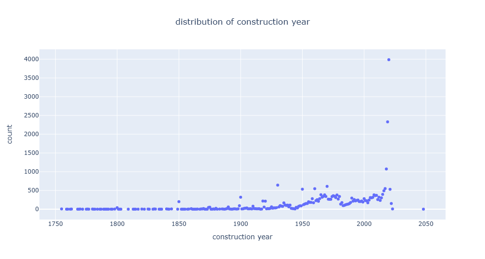

# Belgian House Price Prediction

## Project Overview
This project aims to predict construction cost overruns based on various factors related to the type, location, and features of a building. The goal is to create a model that helps construction firms estimate the potential for cost overruns during the planning and building phases.

## Data Description
The dataset contains information about property sales, including characteristics of the buildings and the type of sale. The columns in the dataset include:

| Column                     | Description                                                                      |
|----------------------------|----------------------------------------------------------------------------------|
| locality                   | The location of the property.                                                   |
| type_of_property           | The type of building. Either 'House' or 'Apartment'.                            |
| subtype_of_property        | More detailed classification of the property type (e.g., house, villa).         |
| price                      | The final sale price of the property.                                           |
| type_of_sale               | Indicates if the sale was private or through a realtor.                         |
| number_of_rooms            | Number of rooms in the building.                                                |
| house_area                 | The total living area of the house (in square meters).                          |
| fully_equipped_kitchen     | Indicates if the kitchen is fully equipped.                                     |
| furnished                  | Indicates if the house is furnished.                                            |
| open_fire                  | Indicates the presence of an open fire.                                         |
| terrace                    | Indicates if there is a terrace.                                                |
| terrace_area               | Area of the terrace (in square meters).                                         |
| garden                     | Indicates if there is a garden.                                                 |
| garden_area                | Area of the garden (in square meters).                                          |
| surface_of_the_land        | Total area of land on which the property is built.                              |
| surface_of_the_plot_of_land| Area of the land on which the house is situated.                                |
| number_of_facades          | Number of facades of the building.                                              |
| swimming_pool              | Indicates if there is a swimming pool.                                          |
| state_of_the_building      | Condition of the building (e.g., new, renovated).                               |
| construction_year          | Year the building was constructed. 

### Data Preprocessing
1. **Missing Value Handling**
- The data has signinficant null values in some columns, some columns were dropped and for others values were imputed

- Outliers for the number of rooms were also detected.

- Outliers for construction year.

Steps taken to clean the data:
1. **Drop Columns**:
   - Removed the `furnished` and `surface_of_the_plot_of_land` columns.

2. **Handle Missing Values**:
   - Filled missing values in `construction_year` with the median.
   - Assumed missing values in `terrace_area` and `garden_area` as 0 (indicating no terrace or garden area).
   - Filled missing values in `surface_of_the_land` with the median.
   - For categorical columns like `state_of_the_building`, filled missing values with the mode.
   - For numeric columns such as `number_of_rooms`, `house_area`, and `number_of_facades`, filled missing values with the median.

3. **Filter Invalid Data**:
   - Dropped rows where `construction_year` is later than 2023.

### Exploratory Data Analysis (EDA)
1. **Univariate Analysis**: Investigate the distribution of key features such as `price`, `house_area`, and `number_of_rooms`.
2. **Correlation Analysis**: Analyze correlations between features and the target variable (`price` or any indicator of cost overrun).
3. **Feature Importance**: Identify the most influential features for predicting cost overruns.
### Feature Engineering

### Modeling

In this project, we employed several machine learning models to predict house prices in the Belgian housing market. The following models were used:

1. **Random Forest**  
   The Random Forest model was trained using the entire feature set. It achieved excellent performance, with an R² score of **0.89** and a Mean Absolute Error (MAE) of **23,544.41**. After performing feature selection and focusing on the most relevant features, the performance slightly decreased with an R² score of **0.88** and an MAE of **22,344.62**. Despite this decrease, the model remained highly effective.

2. **XGBoost (Initial)**  
   The initial XGBoost model was trained using the full feature set and performed similarly to the second Random Forest model. It achieved an R² score of **0.88** and an MAE of **22,344.62**, showing competitive performance compared to Random Forest.

3. **XGBoost (Tuned)**  
   The second XGBoost model was trained with advanced hyperparameters to improve performance. The hyperparameters included:
   - **Learning Rate**: 0.1
   - **Subsample**: 0.8
   - **Max Depth**: 8
   - **Colsample by Tree**: 0.8
   
   Despite the hyperparameter tuning, the performance slightly dropped, with an R² score of **0.79** and an MAE of **49,718.28**.

## Conclusion
In this project, two primary models, **Random Forest** and **XGBoost**, were evaluated based on their performance metrics and suitability for real-world applications.

#### Random Forest
- **Initial Model**: Achieved an R² score of 0.89 and a Mean Absolute Error (MAE) of 22,132.57, explaining 89% of the variance in house prices with low prediction error.
- **Feature Selection**: After selecting top features, performance decreased slightly (R²: 0.86, MAE: 26,141.97), but the model remained robust and reliable.

#### XGBoost
- **Initial Model**: Performed moderately, with an R² score of 0.67 and an MAE of 22,344.62.
- **Tuned Model**: After hyperparameter optimization (learning rate: 0.05, max depth: 8, subsample ratio: 0.8, colsample_bytree: 0.8), the model improved slightly to an R² score of 0.70 but experienced a significant increase in MAE (61,194.28), indicating instability.

### Model Performance Comparison

| Model                 | Configuration            | R² Score | MAE (Mean Absolute Error) | Notes                                                                                     |
|-----------------------|--------------------------|----------|---------------------------|-------------------------------------------------------------------------------------------|
| Random Forest         | Initial                 | 0.89     | 22,132.57                 | Performed excellently, explaining 89% of variance with a low prediction error.            |
|                       | Feature Selection       | 0.86     | 26,141.97                 | Performance decreased slightly after focusing on top features.                            |
| XGBoost               | Initial                 | 0.67     | 22,344.62                 | Initial performance was lower compared to Random Forest.                                  |
|                       | Tuned Hyperparameters   | 0.70     | 61,194.28                 | Hyperparameter tuning improved R² but increased MAE significantly, indicating instability. |

**Random Forest** was selected as the final model due to its consistent performance, computational efficiency, and robustness. It delivered the best balance of predictive power and cost-effectiveness, making it ideal for real-world applications.

## Recommendations
1. **Cost Efficiency**: Use the feature-selected Random Forest model for resource-constrained scenarios as it balances performance and computational cost effectively.
2. **Further Optimization**: Explore hyperparameter tuning for Random Forest (e.g., `max_depth`, `n_estimators`) to enhance performance.
3. **Alternative Models**: Evaluate lightweight models like **LightGBM** for potentially better results with reduced computational demands.
4. **Regular Updates**: Re-train the model periodically with updated data to ensure relevance in dynamic markets.
5. **Explainability**: Leverage feature importance from Random Forest to provide actionable insights into key factors influencing house prices.

By implementing these recommendations, this project showcases how machine learning can be applied effectively in real estate pricing, providing valuable insights and reliable predictions for the Belgian housing market.
